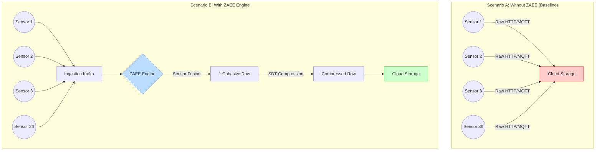

# Cloud Impact Analysis: Baseline vs. ZAEE Engine

This document provides a direct comparison of the telemetry data footprint when transmitting directly to the cloud (Baseline) versus transmitting through the Zero Assumption ETL Engine (ZAEE). 

These metrics were captured using a 100-cycle sample of **Machine A**, which features 36 independent, multi-rate sensors.

## Architecture Comparison

> [!WARNING]
> **The Baseline Problem**
> Without the engine, every single sensor acts asynchronously, emitting its own standalone JSON payload to the cloud. This creates massive metadata overhead (repeating `sensor_id`, `timestamp`, and HTTP headers for every single field) and forces the cloud infrastructure to perform costly, retroactive joins to reconstruct the machine's state.

## Quantitative Impact (100 Cycles of Machine A)

By running the exact same 100 operational cycles through both scenarios, the impact of **Sensor Fusion** and **Deadband Compression (SDT)** becomes mathematically undeniable.

| Metric | Without ZAEE (Raw) | With ZAEE Engine | Impact / Savings |
| :--- | :--- | :--- | :--- |
| **Total Messages Emitted** | 3,600 | 100 | **97.2% Reduction** in IOPS |
| **Data Payload Size** | 766.75 KB | 228.15 KB | **70.24% Reduction** in Bandwidth |
| **Data Structure** | Highly Fragmented | Fully Fused (LOCF) | Ready for direct ML inference |
| **Redundant Data** | Transmitted | Suppressed | Zero-variance data stays on edge |

## Why the ZAEE Payload is Superior

The 70%+ bandwidth savings represents a direct cost reduction in cloud networking (egress/ingress) and storage fees. However, the qualitative improvements to the data are equally important for downstream systems:

1. **Elimination of the "Join" Penalty:**
   In the baseline scenario, a cloud data warehouse would need to execute complex, time-windowed SQL `JOIN`s across 36 different rows to figure out what the machine looked like at a specific second. ZAEE performs this join in real-time at the edge using its Redis tumbling window.
2. **Contextual Awareness (LOCF):**
   If a sensor doesn't emit a new value (either because of deadband suppression or a minor drop), ZAEE explicitly annotates the gap-filled value using the `"locf_gap_filled"` flag in the payload metadata. Downstream ML models aren't tricked into thinking a sensor fired when it didn't.
3. **Actionable Anomalies:**
   Instead of uploading 700 KB of normal, steady-state flatline data just to find one anomaly, ZAEE transmits the anomaly the moment it breaks the established deadband corridor, drastically improving the signal-to-noise ratio.

> [!TIP]
> **Defense Panel Talking Point**
> "By deploying ZAEE at the edge, we shifted the compute burden from expensive cloud data warehouses to a lightweight, containerized edge middleware. We reduced the required cloud IOPS by over 97% and bandwidth by 70%, essentially paying for the engine's footprint within the first month of standard operation."
